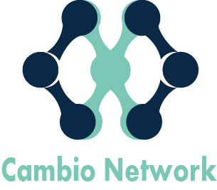

# Cambio Network

## About Cambio Network

Cambio is a Spanish word meaning “change”, which is the goal of our team, to change.

Since Web3 already a big change to Web 2, we hope to bring more changes into the Web 3 world, the first change we want make, is the Cambio Name Service.

## What is Cambio Name Service

The Cambio Name Service(CNS) is a decentralized, almost zero-cost high performance with hybrid resolving, security name service, You can simply think it a substrate based decentralized DNSEC service for both Web2 and Web3. 

Cambio Name Service contains 3 subsystems: 

- Name Asset Manage System
- Cross Chain Bridge System
- Decentralized Name Resolver;

Also there is a core protocol we call Hybrid Name Protocol.

### Core Protocol: The Hybrid Name Protocol (HNP)

This is our core Protocol, which means everything else are developed upon it.

The HNP have full support traditional DNS record type like A for IPv4, AAA for IPv6, CNAME for url etc, and also support web 3 types like account address, contract address, a RMRK NFT, a IPFS file and so on.

### Name Asset Manager System

A **Name Asset** in Cambio Network is like a domain name in web2, with extended ability to access web3 objects. It has the same format of domain name, with support of infinity levels of sub name, and records to resolve.

The Name Asset Manager System basically a substrate pallet which provide functions to Manage Name assets, you can mint and burn a Name Asset for yourself or others, transfer it to another account, you can also add hundreds of resolve records to target any web2 wor web3 object.

#### Zero Cost

Unlike a domain name in other name service, the Name Asset in Cambio Network is **Almost Zero Cost, which means it will cost you almost nothing to have a Name Asset and hold it.**

Why and how to make this possible will be detailed in white paper, we are working on it and will publish in Q3 2022.

### Cross Chain Bridge System

The Cross Chain System is the subsystem which links other subsystem, it provides:

1. chain governance
2. the implement of our economy model

The Cross Chain Bridge System is heavily base on Polkadot cross chain components like XCM, XCVM, XCMP, and share the security and liquidity of Polkadot ecosystem. Thanks to Parity and Polkadot ecosystem,  those cross chain components give us the power and ability to make Name Asset cost almost zero. 

### The Decentralized Name Resolving System

The DNRS is the sub-system to handle the resolving of any record in Name Asset, use the advantage of HNP, it can response to both traditional DNS clients and web3 dapps, contracts and pallets.

The advantage of DNRS is that, for traditional Web2, it can effectively deal with various problems in DNS resolution, such as DNS pollution, the risks of DNS central server or top server errors or panic, etc., and ensure the security and correctness of each record resolving, this important is adapted for Web3 query as well.

## Our Team

We are a fresh new team founded on Jun.1.2022, right now we have 4 members and 1 adviser:

### Aaron Peng

Co-founder, a senior system architect, a Substrate Evangelist, and a rustacean.

### Geoger Li

Co-founder, Substrate Evangelist, a ex-Meituan senior software engineer, ex-Phala engineerr and a high performance distributional database developer

### Bo Zhu

Designer of our Economy model and mathematical model, PhD in Mathematics, University of Utah.

### May

Our front-end adviser, Senior frontend developer and team leader worked in Microsoft and Meituan.

### Jane Zhao

Front-end developer, China Agricultural University.

## Thing we have done during Hackathon
- [x] Arthitect design
- [x] Protocol design
- [x] Math model design
- [x] Economic model design and testing
- [x] preparing the code base
